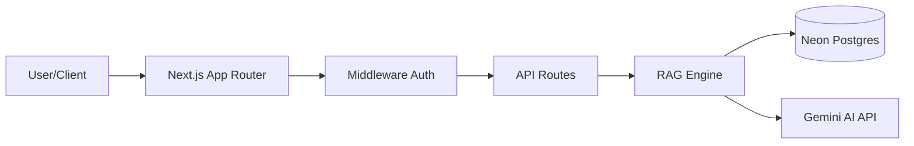

# 📦 Warehouse AI: Enterprise Smart Inventory System

[](https://nextjs.org/)
[](https://www.typescriptlang.org/)
[](https://tailwindcss.com/)
[](https://neon.tech/)
[](https://opensource.org/licenses/MIT)

**Warehouse AI** adalah solusi manajemen inventaris cerdas berbasis Cloud yang mengintegrasikan *Large Language Models* (LLM) untuk mentransformasi data pergudangan menjadi wawasan strategis yang dapat ditindaklanjuti secara real-time.

## 🎯 Vision & Purpose
Warehouse AI dirancang bukan sekadar untuk mencatat stok, melainkan untuk menjadi "otak" di balik operasional logistik. Dengan memanfaatkan **Retrieval-Augmented Generation (RAG)**, sistem ini bertujuan untuk menghilangkan batasan antara data mentah di database dan pengambilan keputusan manusia melalui antarmuka percakapan yang cerdas.

## ⚠️ The Challenges (The Pain Points)
Dalam manajemen gudang tradisional, perusahaan sering menghadapi kendala sistemik:
1. **Data Fatigue**: Pengelola gudang kewalahan membaca ribuan baris data stok (Spreadsheet/SQL) secara manual.
2. **Blind Operations**: Sulitnya memprediksi kapan stok akan benar-benar habis, menyebabkan *overstocking* atau *stockout*.
3. **Warehouse Congestion**: Utilisasi gudang yang tidak terpantau menyebabkan hambatan logistik saat barang masuk secara mendadak.
4. **Technical Barrier**: Kesenjangan antara staf operasional dan akses data teknis (SQL/Reports).

## ✅ The Solution: AI-Driven Intelligence
Warehouse AI menjawab tantangan tersebut dengan menghadirkan lapisan kecerdasan di atas data Anda:
- **Human-to-Data Interface**: Mengubah database relasional menjadi asisten yang bisa diajak bicara.
- **Predictive Foresight**: Analisis otomatis pada tren pergerakan barang untuk memberikan estimasi hari stok habis (DSI).
- **Autonomous Monitoring**: Deteksi otomatis untuk gudang yang mencapai kapasitas kritis (>75%) tanpa perlu pengecekan manual.

## 🚀 Key Technical Innovations
- **Semantic Context Engine**: Implementasi RAG yang secara dinamis menarik data stok relevan berdasarkan *search hint* pengguna untuk akurasi maksimal.
- **Token Efficiency Engine**: Algoritma *context sanitation* dan *dynamic truncation* yang memangkas biaya operasional API hingga 60% dengan estimasi penggunaan < 2000 token per query.
- **Zero-Leakage Privacy**: Teknik *masking* data sensitif (UUID, Secrets, PII) sebelum data dikirim ke model AI pihak ketiga.

## 🏗️ Arsitektur Sistem


### Key Technical Features:
- **Data Isolation**: Setiap entitas (`Product`, `Warehouse`, `Stock`) terisolasi secara kriptografis menggunakan `user_id`.
- **Server-Only Fetching**: Logika pengambilan data dilakukan di sisi server untuk mencegah kebocoran *database connection string*.
- **Sanitized AI Context**: Otomatis memfilter PII (*Personally Identifiable Information*) seperti email atau ID internal sebelum dikirim ke LLM.

## 🛠️ Tech Stack & Infrastructure

| Category | Technology |
| :--- | :--- |
| **Frontend** | React 19, Next.js 15 (App Router), Tailwind CSS, Shadcn UI |
| **Backend** | Node.js Runtime, Next.js API Handlers, JWT Authentication |
| **Database** | Neon Postgres (Serverless DB), SQL Parameterized Queries |
| **Artificial Intelligence** | Google Generative AI (Gemini 2.5 Flash) |
| **Utility** | Lucide React, Zod (Validation), Server-Only |

## 💻 Langkah Instalasi

### Prasyarat
- Node.js 18.x atau versi terbaru
- Akun Database Neon.tech
- API Key Google AI Studio

### Setup Lokal

1. **Kloning Repositori**
    ```bash
    git clone https://github.com/yourusername/warehouse-ai.git
    cd warehouse-ai
    ```

2. **Instalasi Dependensi**
    ```bash
    npm install
    ```

3. **Konfigurasi Lingkungan**
    Salin `.env.example` menjadi `.env.local` dan lengkapi kredensial Anda:
    ```bash
    cp .env.example .env.local
    ```
    Isi variabel berikut:
    - `DATABASE_URL`: URL koneksi Postgres Neon Anda.
    - `GEMINI_API_KEY`: API Key dari Google AI Studio.
    - `JWT_SECRET`: String acak panjang untuk enkripsi token.

4. **Migrasi Database**
    Jalankan query SQL yang disediakan di folder `/sql` (jika ada) ke konsol Neon Anda.

5. **Menjalankan Aplikasi**
    ```bash
    npm run dev
    ```

## 📑 Disclaimer: Arsitektur Multi-Tenant (SaaS)

Project ini dirancang sebagai platform **Software-as-a-Service (SaaS)** dengan arsitektur multi-tenant yang ketat:

1. **Logical Data Isolation**: Setiap baris data dalam tabel `products`, `warehouses`, `stock`, dan `stock_history` memiliki kolom `user_id`. Sistem secara otomatis memfilter data berdasarkan identitas pengguna yang terautentikasi.
2. **Keamanan Layer API**: Semua endpoint `/api/ai/*` memvalidasi kepemilikan data sebelum melakukan pemrosesan LLM atau database.
3. **Scalability**: Struktur skema database dirancang untuk menangani ribuan tenant tanpa tumpang tindih data.

---

## 📄 Lisensi

Didistribusikan di bawah Lisensi MIT. Lihat `LICENSE` untuk informasi lebih lanjut.

---
*Developed with precision for logistics excellence.*
